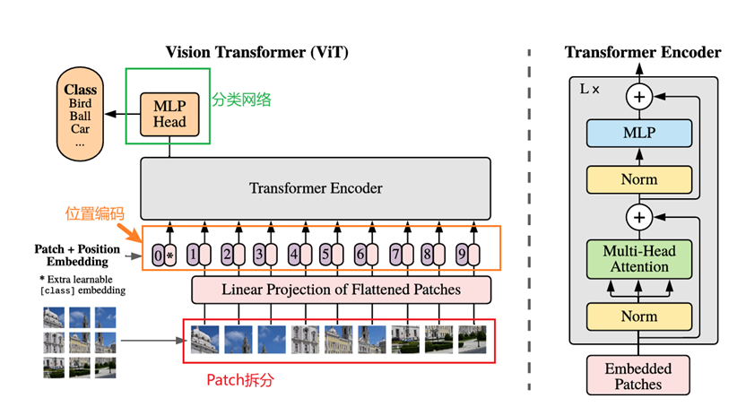
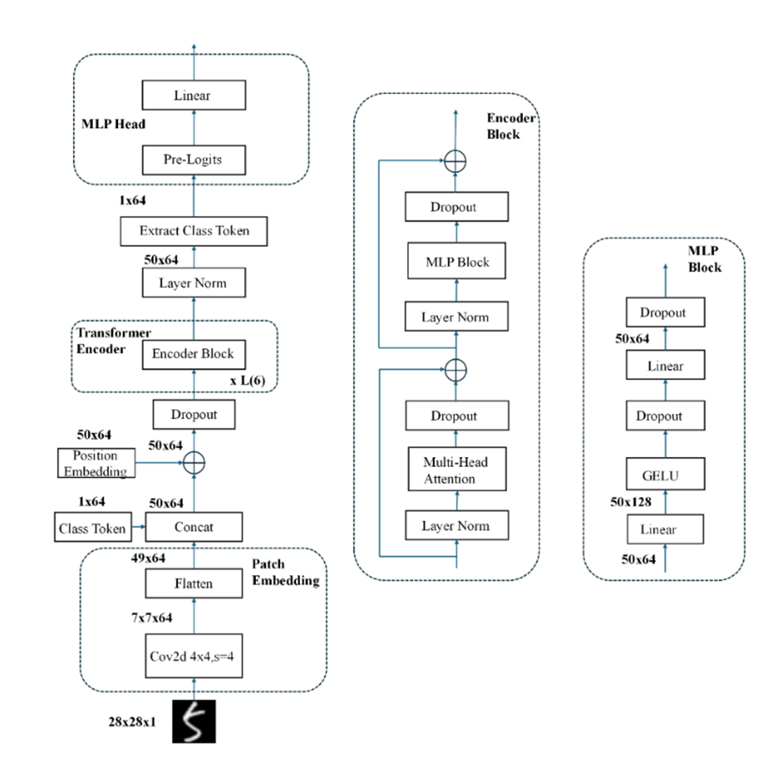
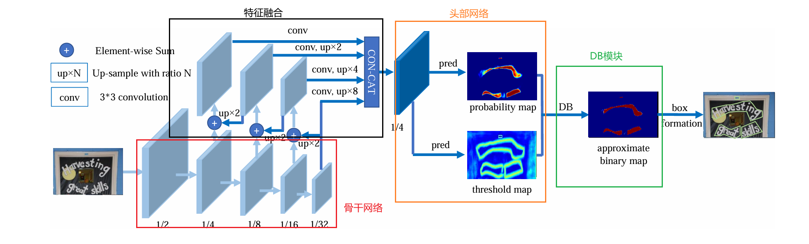
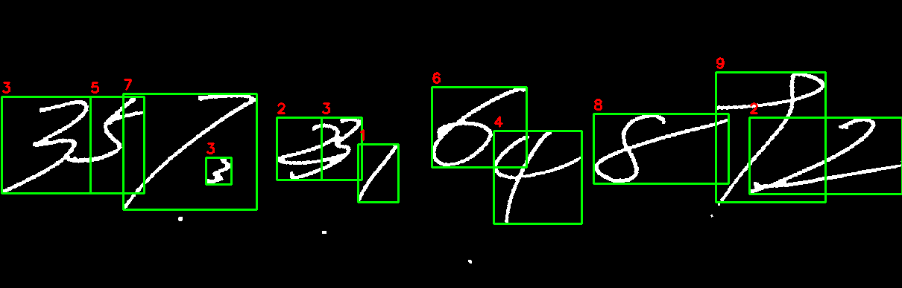

# VIT-HandWritten-Digits-Recogonition

An end-to-end pipeline for handwritten **digit recognition** built on **Vision Transformer (ViT)**.  
It covers **detect/split->preprocess->classify->evaluate/visualize** and works on **MNIST** as well as noisy, real-world images that may contain **multiple digits per image**.

 

---

## 1) Environment

- **OS**: Windows 10/11
- **GPU**: NVIDIA **GeForce RTX 3070 Laptop GPU** (Ampere, compute 8.6)  
- **Driver**: 551.x or newer recommended
- **Python**: 3.9 – 3.11 (tested on 3.10)
- **PyTorch**: 2.4+ with CUDA **12.1** wheels (no standalone CUDA Toolkit needed)

Create a clean environment and install deps:

```bash
# from repo root
python -m venv .venv
# Windows
.venv\Scripts\activate
# macOS/Linux
# source .venv/bin/activate

# PyTorch (CUDA 12.1 wheels). If you are CPU-only, drop the --index-url line.
pip install torch torchvision torchaudio --index-url https://download.pytorch.org/whl/cu121

# Common libs
pip install timm opencv-python pillow numpy matplotlib scikit-learn tqdm einops
